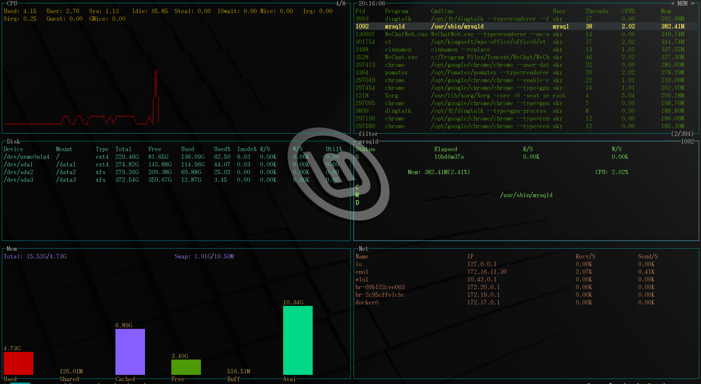

# xtop
一个系统监控工具





## 说明

- 监控CPU，内存，磁盘，网络带宽，进程信息等

  


## 使用


### 启动

```
# chmod u+x ./xtop
# ./xtop
```


### 快捷键

- 退出: `q` or `<C-c>`

- 选择process(兼容`vim`按键)

  - `k` or `<up>`: 向上
  - `j` or `<down>`： 向下
  - `gg` or `<Home>`： 跳到第一行
  - `G` or `<End>`: 跳到最后一行
  - `<Enter>`: 选中process

- process排序(兼容`top`按键)

  - `M`: 根据内存使用量排序
  - `P`: 根据CPU使用率排序

- 过滤process

  - `f`： 根据proces名称过滤

  - `<Enter>`: 固定过滤名称
  
  - `<Del>`: 清空过滤名称，退出过滤模式
  
    
